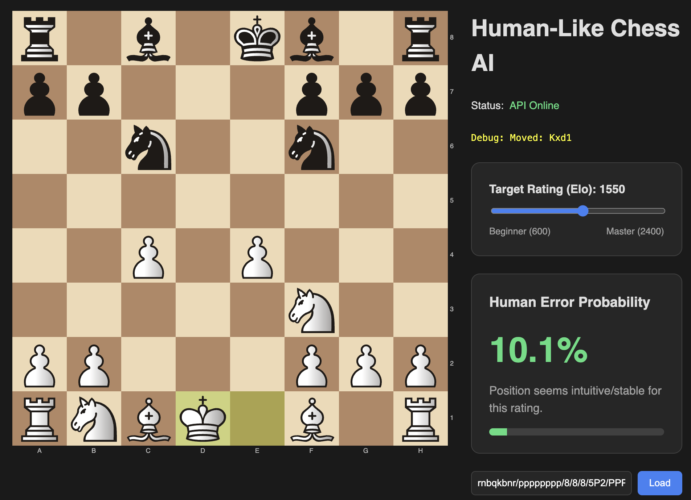

# EXPERIMENTAL: SMALL DATASET / PROTOTYPE ONLY

This project is **experimental** and the current model is trained on a **very small dataset** (roughly ~2,000 games). That is far below what is needed for reliable, stable predictions. Expect noisy outputs, weak generalization, and  nonsense in positions. The architecture and data pipeline are for much larger datasets.
(soon I will try to run on 100k games)

# Human-Like Chess AI: Project Overview

## Goal
The primary goal of this project is to create a chess AI that **plays like a human**, not just a perfect engine. Unlike Stockfish, which always seeks the optimal move, use this system to:
1.  **Understand Position Complexity**: Identifying positions where humans are likely to crack under pressure for specific ELO
2.  **Simulate Human Errors**: predicting likely blunders based on the specific **Elo rating** of the player.
3.  **Human Error Prediction (Current)**: The system predicts the *probability* of a blunder for a given position and Elo.
4.  **Ultimate Sparring Partner (Future Goal)**: Integrating this probability engine into a chess bot to create an opponent that plays "realistic" mistakes rather than random computer errors.

“Best” (engine‑best) optimizes objective eval, while “opponent blunder likelihood” optimizes human error risk. They often correlate in sharp positions, but they can diverge—some objectively best moves simplify and reduce blunder chances, while a slightly inferior move can increase complexity and opponent error risk. 



## How It Works
This project uses a deep neural network (Keras/TensorFlow).
> **Note**: Currently, the model is trained on a small prototype dataset (~2,000 games) due to hardware and time limitations. To achieve optimal results and true human-like performance, the system is designed to be trained and tested on a massive dataset (millions of games) in the future.

1.  **Data Processing**: We analyze PGN games using Stockfish to label every move. We calculate if a human move was a "blunder" (lost >1.0 pawn) compared to the optimal line.
2.  **Training**: The model learns to predict `Probability(Blunder)` given:
    *   The current Board State (Piece locations).
    *   The Target Elo (e.g., "How likely is a 1500 Elo player to blunder here?").
    *   **Model Architecture**: A compact CNN (~400k parameters) optimized for training on moderate datasets (2k - 100k games).
3.  **Inference**: When playing, the engine can use this probability to decide whether to play a "perfect" move or intentionally blunder, simulating a human opponent's psychological frailty.

## Prerequisites

1.  **Python 3.10+** (Recommend using a virtual environment)
2.  **Stockfish**: Must be installed and accessible.
    *   **Mac (Homebrew)**: `/opt/homebrew/bin/stockfish`
    *   Update `src/process_data.py` `STOCKFISH_PATH` if your path is different.
3.  **Dependencies**:
    *   **Activate Environment**:
        ```bash
        source .venv/bin/activate
        ```
    *   **Install Packages**:
        ```bash
        pip install -r requirements.txt
        ```

## 1. Prepare Your Data

The Model requires a single PGN file containing the chess games you want to learn from.

1.  **Gather your PGN games**:
    *   Ensure the PGN headers contain `WhiteElo` and `BlackElo` tags.
    *   **Recommended Source**: [Lichess Database](https://database.lichess.org/) (Massive collection of rated games).
2.  Rename your file to `games.pgn`.
3.  Place it in the `data/raw/` directory:
    ```
    human-chess/
    ├── data/
    │   └── raw/
    │       └── games.pgn
    ```

## 2. Process Data (Generate Labels)

This step uses Stockfish to analyze every position in your games. It calculates:
*   **Best Move**: The optimal move.
*   **Centi-pawn Score**: The evaluation of the position.
*   **Blunder Check**: Did the human player's move drop the score significantly?

**Configuration**:
*   Open `src/process_data.py`.
*   Adjust `DEPTH = 10` (Higher = more accurate labeling, but much slower).
*   Adjust `MAX_GAMES = 1000` (Limit how many games to process).

**Run the script** (Ensure `.venv` is active):
```bash
python src/process_data.py
```
*Output*: This will create `data/processed/chess_complexity_data.csv`.

## 3. Train the Model

This step trains the Keras Neural Network using the CSV data generated in step 2.

**Run the training script** (Ensure `.venv` is active):
```bash
python src/train_model.py
```

*Output*: This will save the trained model to `models/human_error_model_elo.keras`.

## 4. Scaling Up (100k+ Games)

If you train on a massive dataset (e.g., 500k+ positions), you might want to increase the model size to capture more nuance. 
Open `src/train_model.py` and modify `build_model`:

1.  **Increase Filters**: Change `Conv2D(64, ...)` to `Conv2D(128, ...)` or even `256`.
2.  **Deeper Network**: Add another `Conv2D` + `MaxPooling2D` block.
3.  **Dense Layers**: Increase `board_features = layers.Dense(128, ...)` to `256` or `512`.

**Example for Big Data:**
```python
x = layers.Conv2D(128, kernel_size=3, padding='same', activation='relu')(board_input) # More filters
x = layers.Conv2D(128, kernel_size=3, padding='same', activation='relu')(x)
x = layers.MaxPooling2D(pool_size=(2, 2))(x)
# Add another block
x = layers.Conv2D(256, kernel_size=3, padding='same', activation='relu')(x) 
x = layers.MaxPooling2D(pool_size=(2, 2))(x)
```

## 5. Run the Application

Once trained, you can visualize the results.

**Start the Backend (API)** (Ensure `.venv` is active):
```bash
uvicorn src.api:app --reload
```

**Start the Frontend (UI)**:
```bash
cd frontend
npm run dev
```

Visit `http://localhost:5173` to play!
